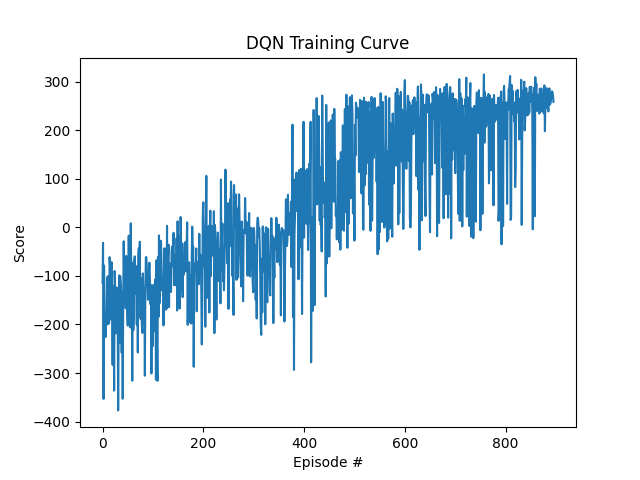

# 🚀 Autonomous Lunar Lander: Dueling Double DQN

[](#) *(Insert your live demo link here later)*

An implementation of a Deep Reinforcement Learning agent trained to autonomously navigate the Gymnasium `LunarLander-v3` continuous control physics environment. 

While a standard DQN can eventually solve this environment, it suffers from severe Q-value overestimation and high variance. This project implements a custom **Dueling Double Deep Q-Network (D3QN)** to isolate state-value estimation from action-advantage, achieving a highly stable, risk-adjusted convergence score of **242.25** in under 800 episodes.

## 🧠 Neural Network Architecture
The agent replaces the standard Multi-Layer Perceptron with a bifurcated Dueling architecture to decouple the inherent value of a state from the specific benefit of an action.

* **Input:** 8-dimensional continuous vector `[X/Y position, X/Y velocity, angle, angular velocity, left leg contact, right leg contact]`
* **Shared Feature Extractor:** Two dense layers (256 neurons each) with ReLU activations.
* **Value Stream V(s):** Dense layer (128 neurons) evaluating the baseline safety of the current environment state.
* **Advantage Stream A(s,a):** Dense layer (128 neurons) evaluating the marginal benefit of the 4 discrete thruster actions.
* **Recombination:** Outputs are aggregated using a mean-subtracted forward pass for mathematical stability: 
  
  $Q(s,a) = V(s) + \left( A(s,a) - \frac{1}{|\mathcal{A}|} \sum_{a'} A(s,a') \right)$

## ⚙️ Hyperparameters & Optimization
To prevent the agent from settling into a local minimum (e.g., hovering endlessly to avoid crash penalties), epsilon decay was aggressively tuned to force extended exploration.

| Parameter | Value | Description |
| :--- | :--- | :--- |
| **Batch Size** | 64 | Minibatch size sampled from Replay Buffer |
| **Buffer Size** | 100,000 | Maximum capacity of the experience replay memory |
| **Gamma** | 0.99 | Discount factor for future rewards |
| **Tau** | 0.001 | Soft update parameter for the Target Network |
| **Learning Rate** | 5e-4 | Adam optimizer learning rate |
| **Epsilon Decay** | 0.997 | Slower decay to ensure robust late-stage exploration |

**Loss & Clipping:** Implemented **Smooth L1 (Huber) Loss** and **Gradient Norm Clipping** (capped at 1.0) to prevent catastrophic forgetting during highly volatile early-episode crashes.

## 📈 Training Convergence & Results
The standard win condition for Lunar Lander is an average score of 200 over 100 episodes. To ensure absolute deployment stability, the target stopping condition for this model was strictly elevated to **>= 240**.

* **Result:** Successfully solved and stabilized in **796 episodes**.
* **Observation:** The slower epsilon decay forced the agent through a local minimum plateau around episode 600, eventually breaking through to a highly consistent >240 rolling average with minimized drawdown variance.



## 📂 Project Structure
```text
├── models/
│   ├── dqn_weights.pth        # Final converged model weights
│   └── dqn_weights_best.pth   # Highest scoring weights checkpoint
├── src/
│   ├── __init__.py
│   ├── dqn_agent.py           # Replay buffer and Double DQN Bellman logic
│   └── network.py             # PyTorch Dueling DQN class definition
├── app.py                     # Streamlit frontend dashboard
├── train.py                   # The RL training loop and metric tracker
└── requirements.txt
